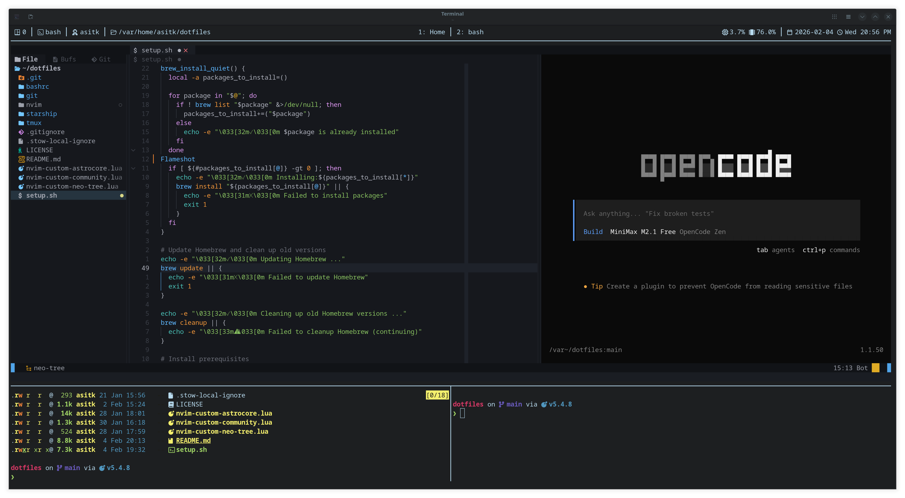

# DevBox: Portable Dev Environment

A personal set of curated tools and scripts that play together :)



## 📋 Prerequisites

Before starting, ensure you have the following installed:

- **Git** - Version control system
- **Homebrew** - Cross-platform package manager

### Installing Prerequisites

**Git:**
```bash
# On Linux (Ubuntu/Debian)
sudo apt update && sudo apt install git

# On Linux (Fedora/CentOS)
sudo dnf install git

# On macOS
brew install git
```

**Homebrew:**
```bash
# Install Homebrew (works on Linux and macOS)
/bin/bash -c "$(curl -fsSL https://raw.githubusercontent.com/Homebrew/install/HEAD/install.sh)"
```

## 🚀 Quick Start

```bash
# Clone the repository
git clone <repository-url> ~/dotfiles
cd ~/dotfiles

# Run the setup script
./setup.sh
```

## 📋 What's Included

### 🛠️ Development Tools
- **Neovim** - AstroVim with AI-powered coding assistance (OpenCode plugin)
- **Git** - Enhanced with Delta for beautiful diffs and smart aliases
- **Tmux** - Terminal multiplexer with custom keybindings
- **Starship** - Minimal, fast, and customizable prompt

### 🎨 Shell Environment
- **Bash** - Optimized `.bashrc` with useful aliases and functions
- **SSH Agent** - Automatic key management
- **Path Management** - Smart PATH configuration

### 📦 Package Management
- **Homebrew** - Cross-platform package manager
- **Automatic Installation** - 50+ essential tools and utilities

## 🏗️ Project Structure

```
dotfiles/
├── setup.sh                   # Main installation script
├── patches/                   # Custom nvim patches
├── bashrc/.bashrc
├── git/.config/git/
├── LICENSE
├── nvim/.config/nvim/
├── starship/.config/
├── tmux/.config/tmux/
├── docs/
└── README.md                  # This file
```

## ⚙️ Installation

### Prerequisites
- Linux (Ubuntu, Fedora, Arch, openSUSE, RHEL) or macOS
- Internet connection for package installation
- Git and Homebrew (see prerequisites section above)

### Automated Setup
The `setup.sh` script handles everything:

1. **OS Detection** - Verifies Linux/macOS compatibility
2. **Homebrew Installation** - Sets up package manager if needed
3. **Package Installation** - Installs 50+ essential tools:
   - Development: `git`, `gcc`, `make`, `cmake`, `go`, `node`, `python`, `ruby`
   - Terminal: `nvim`, `tmux`, `starship`, `eza`, `ripgrep`, `fd`, `fzf`
   - Utilities: `lazygit`, `delta`, `bat`, `tree`, `btop`, `zoxide`
   - Fonts: Nerd Font collection for better UI
4. **Configuration Stowing** - Uses GNU Stow to symlink dotfiles
5. **Neovim Setup** - Runs headless installation for plugin setup

### Manual Setup
If you prefer manual installation:

```bash
# Run the setup script directly
./setup.sh
```

## 🎯 Key Features

### Smart Installation
- **Error Handling** - Comprehensive error checking with colored status messages
- **Cross-Platform** - Works on multiple Linux distributions and macOS

### Development Environment
- **AstroVim** - Pre-configured Neovim with LSP, treesitter, and plugins
  - Custom patches include:
    - **AI Integration**: OpenCode NVim plugin for AI-powered coding assistance
    - **Terminal Integration**: Vim-tmux-navigator for seamless navigation
    - **Enhanced Diagnostics**: Trouble.nvim for better error management
    - **Language Support**: Pre-configured packs for Python, Rust, Lua, Zig, Java, TypeScript, C++, and more
    - **Colorschemes**: Catppuccin and Tokyonight themes
    - **Web Development**: HTML/CSS, JSON, YAML, XML, and SQL support
    - **DevOps Tools**: Docker and Markdown pack integrations
    - **File Explorer**: Customized Neo-tree with real-time updates and visible hidden files
    - **Backup System**: Automated timestamped backups with rotation (~/.local/state/nvim/backup/)
    - **Tab Management**: Extended tab navigation and manipulation keybindings
- **Git Integration** - Enhanced diffs, commit signing, and useful aliases
- **Terminal Multiplexing** - Tmux with vim-tmux-navigator and custom plugins
- **Modern Shell** - Starship prompt with Git status and environment info

### Productivity Tools
- **File Navigation** - `eza`, `ripgrep`, `fd`, `fzf` for efficient file operations
- **Git Workflow** - `lazygit` for intuitive Git management
- **System Monitoring** - `btop` for resource monitoring
- **Smart CD** - `zoxide` for directory jumping
- **Enhanced Viewing** - `bat` for syntax-highlighted file content (upgraded cat)
- **Quick Documentation** - `tldr` (tealdeer) for simplified man pages with examples

## 🔄 Maintenance

### Updating Packages
```bash
brew update && brew upgrade
```

### Updating Neovim Plugins
```bash
nvim --headless +q  # AstroVim handles plugin updates automatically
```

### Re-stowing Configurations
```bash
cd ~/dotfiles
stow -R git nvim starship tmux bashrc
```

## 🛠️ Customization

### Adding New Configurations
1. Create the configuration file in the appropriate directory
2. Add the directory to the stow command in `setup.sh`
3. Test with `stow -R <directory>`

### Modifying Package List
Edit the package lists in `setup.sh` (lines 22-29 for tools, 33-35 for fonts)

### Shell Customization
Add custom aliases and functions to `bashrc/.bashrc`

## 📚 Included Tools

### Core Development
- **git** - Version control
- **nvim** - Modern Vim configuration
- **tmux** - Terminal multiplexer
- **gcc/make/cmake** - Build tools

### Languages & Runtimes
- **node** - JavaScript runtime
- **go** - Go language
- **python** - Python (via Homebrew)
- **ruby** - Ruby language
- **php** - PHP language
- **java** - OpenJDK
- **julia** - Julia language
- **perl** - Perl language

### Terminal Enhancement
- **starship** - Custom prompt
- **eza** - Modern `ls`
- **ripgrep** - Fast search
- **fd** - File finder
- **fzf** - Fuzzy finder
- **bat** - Enhanced `cat`
- **delta** - Git diff viewer
- **lazygit** - Git TUI

### System Utilities
- **tree** - Directory visualization
- **btop** - System monitor
- **zoxide** - Smart directory navigation
- **trash-cli** - Safe file removal
- **multitail** - Log monitoring
- **shfmt** - Shell formatting
- **shellcheck** - Shell script analysis

## 🐛 Troubleshooting

### Common Issues
1. **Permission Denied** - Make sure scripts are executable: `chmod +x *.sh`
2. **Stow Conflicts** - Remove existing config files or use `trash` command
3. **Neovim Issues** - Delete `~/.local/share/nvim` and re-run setup
4. **Homebrew Issues** - Follow on-screen instructions for PATH setup

### Getting Help
- Check script output for error messages
- Verify all prerequisites are installed
- Ensure you have proper permissions in your home directory

## 💾 Backup and Safety

### Configuration Backups

The setup script automatically backs up your existing configurations before installation:

| Backup Location | What is Backed Up |
|----------------|-------------------|
| `/tmp/nvim` | Existing Neovim configuration from ~/dotfiles/nvim |
| `~/.local/share/Trash/ or ~/.Trash (macOS)` | Existing configs via trash-cli |
| `~/.config/nvim/lua/plugins/astrocore.lua.bak` | Existing AstroCore config |
| `~/.config/nvim/lua/plugins/neo-tree.lua.bak` | Existing Neo-tree config |
| `~/.config/nvim/lua/plugins/community.lua.bak` | Existing AstroCommunity config |

### What Gets Moved to Trash

Before stowing new configurations, the following existing configs are moved to trash:
- `~/.bashrc`
- `~/.config/git/`
- `~/.config/nvim/`
- `~/.config/tmux/`
- `~/.config/starship/`

### Restoring Backups

To restore from trash:
```bash
trash --list    # List trashed files
trash --restore # Restore all files
```

To restore from `.bak` files:
```bash
mv ~/.config/nvim/lua/plugins/astrocore.lua.bak ~/.config/nvim/lua/plugins/astrocore.lua
mv ~/.config/nvim/lua/plugins/neo-tree.lua.bak ~/.config/nvim/lua/plugins/neo-tree.lua
mv ~/.config/nvim/lua/plugins/community.lua.bak ~/.config/nvim/lua/plugins/community.lua
```

### Recovery

If something goes wrong during setup:
1. Check `/tmp/nvim` for the original nvim configuration
2. Check `~/.local/share/Trash/ or ~/.Trash (macOS)` for any moved dotfiles
3. Check `~/.config/nvim/lua/plugins/` for `.bak` backup files (astrocore.lua.bak, neo-tree.lua.bak, community.lua.bak)

## 📄 License

This project is licensed under the MIT License - see the [LICENSE](LICENSE) file for details.

Feel free to use, modify, and distribute according to your needs.

## 🤝 Contributing

Contributions are welcome! Please:
1. Fork the repository
2. Create a feature branch
3. Make your changes
4. Test thoroughly on Linux and macOS
5. Submit a pull request

---

**Happy Coding! 🎉**
